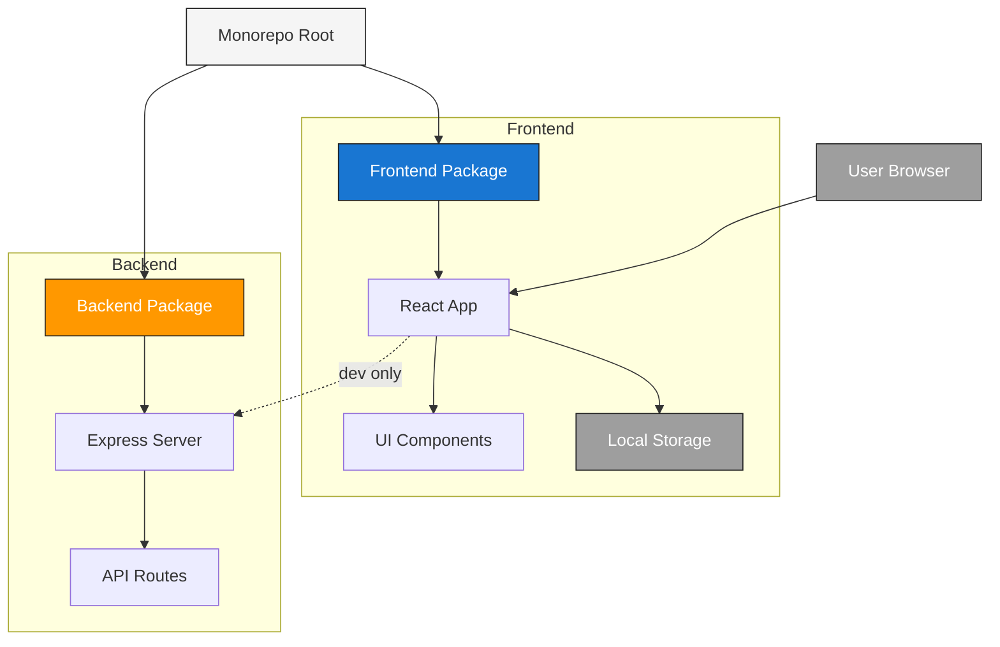
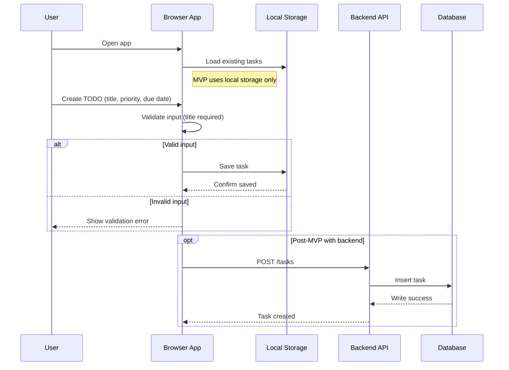

# Cloud Architecture Overview

## Monorepo Architecture

- Monorepo contains two packages: frontend (React) and backend (Express).
- Frontend manages UI and persists tasks in local storage.
- Backend provides an API server for future use; MVP operates without backend persistence.
- User interacts with the React app in the browser; backend may be used in development.

## Create TODO Sequence

- Sequence shows user creating a TODO.
- MVP persists locally; optional post-MVP shows backend flow.
